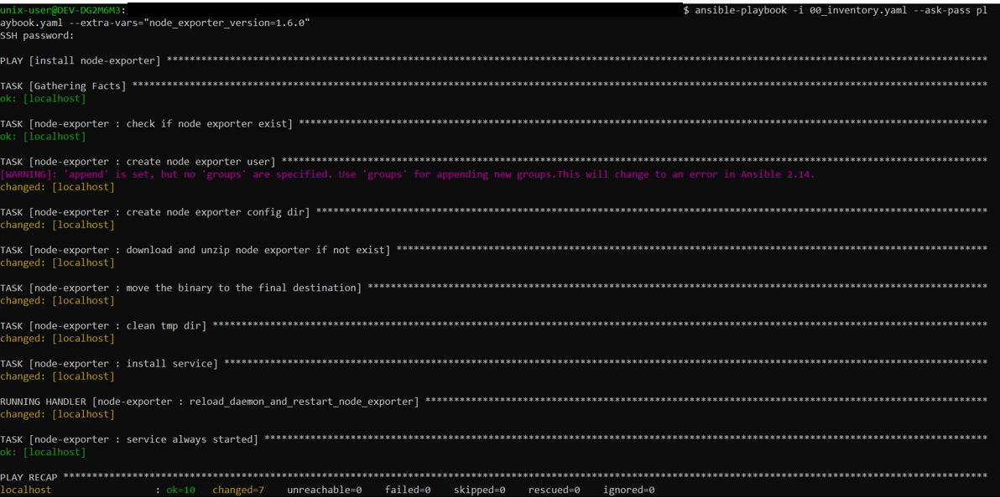
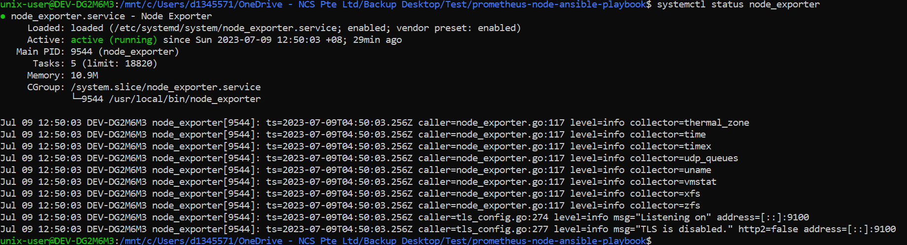

# prometheus-node-ansible-playbook

### Command used to install 
    version installed : 1.6.0
    installed in localhost of windows subsystem of linux (ubuntu)
ansible-playbook -i 00_inventory.yaml --ask-pass paybook.yaml --extra-vars="node_exporter_version=1.6.0"

## Command result log

## screencapture post installation 
